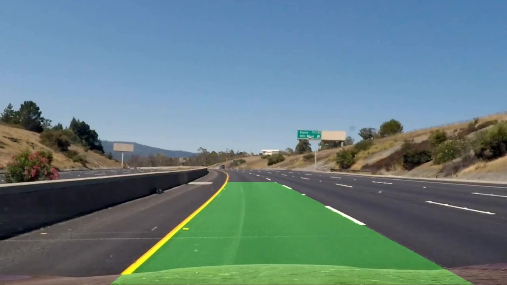

# Project: Advanced Lane Line Finding
### by David Aliaga

---

## Overview

This report is to be submitted to the second Project in Udacity's Self Driving Car Engineer Nanodegree Program. 
The objective of this project is to find the lane lines in a highway from a video taken by a camera attached to the vehicle. Different than the previous project, this time the road includes curves and not only straight navigating. 

The project uses computer vision techniques to achieve its objective. This project includes:

* Camera Calibration: Here I used the camera calibration chessboard images provided in the ``camera_cal`` folder to calculate the distortion coefficients in order to distort images. Once achieved this, these are stored in a file so that this process has to be done once

* Apply distortion correction to the image we are processing. (Either a file or a frame from a video)

* Threshold the image using Sobel and Color (HLS) gradient.

* Apply a prespective transformation to the resulting image so that I can have a bird's eye image. 

* Find the lane lines pixels on this image either from scratch or based on previous findings. Once this is done fit to find the lane lines. 

* Project the findings back to the "world", that is the original undistorted image. 

* Determine the curvature and the vehicle position from the center.

* Display of the results

[//]: # (Image References)

[image1]: output_images/original_undistorted12.jpg "Undistorted12"
[image2]: output_images/original_undistorted1.jpg "Undistorted1"
[image3]: output_images/original_undistorted_road.jpg "Undistorted Road"
[image4]: output_images/color_binary6.jpg "Color binary"

[image5]: output_images/combined_binary6.jpg "Combined binary"
[image6]: output_images/undistorted_thresholded6.jpg "Color and Combined binary"

[image7]: output_images/thresholded_bird4.jpg "Thresholded Bird"
[image8]: output_images/world_bird4.jpg "World Bird"

[image9]: output_images/tracking_lanes_scratch2.png "Tracking Lanes 1"

[image10]: output_images/tracking_lanes_prior2.png "Tracking Lanes 2"

[image11]: output_images/process_test1.jpg "Process 1"
[image12]: output_images/process_test1B.jpg "Process 1B"

[image13]: output_images/process_test2.jpg "Process 1"
[image14]: output_images/process_test2B.jpg "Process 1B"

[image15]: output_images/process_test3.jpg "Process 1"
[image16]: output_images/process_test3B.jpg "Process 1B"

[image17]: output_images/process_test4.jpg "Process 1"
[image18]: output_images/process_test4B.jpg "Process 1B"

[image19]: output_images/process_test5.jpg "Process 1"
[image20]: output_images/process_test5B.jpg "Process 1B"

[image21]: output_images/process_test6.jpg "Process 1"
[image22]: output_images/process_test6B.jpg "Process 1B"

[image23]: output_images/process_straight1.jpg "Process 1"
[image24]: output_images/process_straight1B.jpg "Process 1B"

[image25]: output_images/process_straight2.jpg "Process 1"
[image26]: output_images/process_straight2B.jpg "Process 1B"

[video1]: output_video/project_video_out.mp4 "Video"

[image27]: test_images/challenge_1.jpg "challenge 1"
[image28]: output_images/problematic1.png "challenge 1"

---

## Camera Calibration

Notebooks: 
- [CameraCalibration.ipynb](code/MyCameraCalibration.ipynb)
- [SavingUndistortParameters.ipynb](code/SavingUndistortParameters.ipynb)

Libraries
- [my_camera_cal.py](code/scripts/my_camera_cal.py)

The camera calibration functions can be found on the file ``my_camera_cal.py`` and are the following:

* find_points
* undistort
* saveValuesToUndistort
* readValuesToUndistort
* unwarp
* image_perspective

The way to use this can be found in the notebook ``MyCameraCalibration.ipynb``.

``find_points`` finds the object points and the image points necessary to undistort an image. To do this, it applies OpenCV's ```findChessboardCorners`` function to all the chessboard calibrating images in the ``camera_cal`` folder. 

Then it applies the function ``undistort`` to the images. As an example for the image ``calibration12.jpg`` we can see:

![Undistorting image 12][image1]

Next, as you can see in the ``SavindUndistortParameters.ipynb`` but this time, instead of displaying an undistorted image we call the function ``saveValuesToUndistort`` which calibrates the camera to find the camera matrix and the distortion coefficients. It saves then these values to a file in the config folder. (For example ``config\my_values_to_undistort.p``)

---
From now on I explain how I process images (the "pipeline")

## Undistorting an image

Notebooks:
- [usingSavedParameters.ipynb](code/usingSavedParameters.ipynb)
- [Undistort_Roads.ipynb](code/Undistort_Roads.ipynb)

Libraries
- [my_camera_cal.py](code/scripts/my_camera_cal.py)

As a first example in the ``usingSavedParameters.ipynb`` notebook I do a similar undistortion as previously but now instead of calculating the points with ``find_points`` which takes time, I used the function ``readValuesToUndistort`` which is much more practical when we do frames processing

As a result we can see:

![Undistorting image 1][image2]

Using the same technique I process a road image in the ``Undistort_Roads.ipynb`` notebook


![Undistorting Road][image3]


---

## Thresholding an image

Notebooks:
- [Color_and_Gradient-3.ipynb](code/Color_and_Gradient-3.ipynb)

Libraries
- [my_camera_cal.py](code/scripts/my_camera_cal.py)
- [my_pipeline.py](code/scripts/my_pipeline.py)
- [my_color_thresh.py](code/scripts/my_color_thresh.py)
- [my_sobel_thresh.py](code/scripts/my_sobel_thresh.py)

Next, and once I have an undistorted image, I had to apply some thresholding to the image. To do this in the ``Color_and_Gradient-3.ipynb`` I read an image (say ``test6.jpg``) and undistort it. Once I have this undistorted image, I use the ``pipeline`` function found in the ``my_pipeline.py`` file to get a color binary and a combined binary images

The color binary is:

![Color Binary][image4]

in which we can see in blue the color channel threshold and in green the sobel gradient threshold. 

I combined both in the combined binary image:

![Combined Binary][image5]

Now, to see what is happening in the ``pipeline`` function, I applied first an absolute sobel thresholding in the X direction with threshold (20,100) . (This process can be found in the ``my_sobel_thresh.py`` file. It involves graytransforming the image, applying the Sobel operation, taking the absolute value and applying the threshold)

Then I applied the ``HLScolor_thresh`` function (found in the ``my_color_thresh.py`` file) with channel S and threshold (110,255). Then I produced the color binary by stacking the results and the combined binary by combining the results.

![Color and Combined Binary][image6]

---

## Perspective Transformation

Notebooks:
- [Perspective_change.ipynb](code/Perspective_change.ipynb)

Libraries:
- [my_camera_cal.py](code/scripts/my_camera_cal.py)
- [my_pipeline.py](code/scripts/my_pipeline.py)

After doing the previous processing and having a thresholding image, I applied the ``image_perspective`` function (found in the ``my_camera_cal.py`` file) 

As a result I got a bird's eye view image

![Bird's eye image][image7]

and to see how it looks in the real world I applied the same function to the undistorted (pre-threshold) image to get

![Bird's eye image][image8]

In the ``image_prespective`` function, I just applied OpenCV's *getPerspectiveTransform* and *warpPerspective* functions wiht a manually chosen set of points 


       source=np.float32 ([(580, 460), (202, 720), (1110, 720), (703, 460)]), 
       destino=np.float32([(336, 0), (336, 720), (976, 720), (976, 0)]
   
---

## Lane Line Finding

Notebooks:
- [Tracking_Lanes3.ipynb](code/Tracking_Lanes3.ipynb)
- [Tracking_Lanes_Operation.ipynb](code/Tracking_Lanes_Operation.ipynb)

Libraries:
- [my_line_finding.py](code/scripts/my_line_finding.py)

Here I have developed two ways of finding lanes. Both are defined in the ``my_line_finding.py`` file. One works on scratch from an image with the function ``fit_polynomial``. The other one takes into account the previous fit polynomials to get the new ones, in the function ``search_around_poly``. 

In the ``Tracking_Lanes3.ipynb`` workbook you can see this explicitly. 

First we find the lanes by sliding windows and fitting a polynomial in the left and the right

![Tracking Lanes from scratch][image9]

Using the output of this function (the polynomial) I apply the other method to find the lanes

![Tracking Lanes from prior data][image10]

In the ``Tracking_Lanes_Operation.ipynb`` notebook I do something similar but this time I have put both methods in one function ``process`` in this workbook. (This function is the basis of the final function I am going to use for the whole processing later)

The ``fit_polynomial`` function find the lanes pixels first, by sliding windows with the ``find_lane_pixels`` function and then uses Numpy's *polyfit* function to find the quadratic coefficients that fit on those pixels. The pixel finding uses an hystogram to find the starting points and then iterates through windows that can be adjusted to the left of to the right. Too few pixels can generate bad results so I only considered regions with more than 200 pixels to consider this displacement. Otherwise the next window is just above the previous one. 

The ``search_around_poly`` function uses a similar approach. First it finds the lane pixels with the ``find_lane_pixels_area`` function and then uses numpy's *fit_poly* function similarly. The pixel finding area process this time takes into account previous fitted results to search only around the area. 

---

## Projecting back to the camera view

Notebooks:
- [Solution_Book1.ipynb](code/Solution_Book1.ipynb)


Libraries:
- [my_process.py](code/scripts/my_process.py)

Once I have done the previous steps, it is time to project the found lanes to the camera view ("the world"). You can find this processing in the ``Solution_Book1.ipynb`` notebook. 

In this notebook all test images are processed and visualized and saved on the folder ``output_images``

For example we have the output of processing test1.jpg with the first process is:

![Example process 1][image11]

with previous information is

![Example process 1B][image12]

In the folder the images found with the processing from scratch are of the form *process_XXX.jpg*  and the ones found with the processing using past fit information are *process_XXXB.jpg*. You could notice that there is no change noticeable between those. 

The ``process`` function that I used is found in the ``my_process.py`` file. It reads an image, undistort it, applies the threshold with pipeline, change the perspective, based on wheter there is prior information calls fit_polynomial or search_around_poly and finally applies the ``back_to_world`` function. This function applies OpenCV *getPerspectiveTransform* and  *warpPerspective*  to transform the lane curves from the bird's eye to the camera view.  

---

## Curvature and Vehicle Position

Notebooks:
- [Solution_Book2.ipynb](code/Solution_Book2.ipynb)


Libraries:
- [my_process.py](code/scripts/my_process.py)

In the ``Solution_Book2.ipynb`` I added to the previous solution book the calculation of the curvature and the vehicle position. For the curvature I used the ``measure_curvature_pixels`` function found on the ``my_process.py`` file which is applying the *radius of curvature* equation:

$$
R_{curve}=\frac{[1+(\frac{dx}{dy})^2]^{3/2}}{|\frac{d^2x}{dy^2}|}
$$

so for a quadratic equation 

$$
f(y)=Ay^2+By+C
$$

this is simply

$$
R_{curve}=\frac{[1+(2Ay+B)^2]^{3/2}}{|2A|}
$$

For the vehicle position I used the function ``calc_vehicle_pos`` written in the ``Solution_Book2.ipnyb`` notebook which calculates the difference between the X position of the vehicle and the center of the image. This X position is the middle of the two positions where the fit lanes intersect the lower (biggest Y) position. 

---

## The process applied to the test video

Notebooks:
- [VideoProcessing1.ipynb](code/VideoProcessing1.ipynb)

Libraries
- [my_process.py](code/my_process.py)

As the final step of this project and to apply all of what I have written above, I used the process on the frames of the project_video. You can see the results on the ``output_video`` folder on the file ``project_video_out.mp4``
(There is also a csv file which is the log of the fit lanes)

To do this I used the function ``process_image`` defined in the notebook. This function does the following:

It takes a frame, and applies the ``process2`` function (defined in the ``my_process.py`` file) . This is similar to the ``process`` function I described in previous sections, the only difference that it does not open a file but receives a frame.  
This function is called *without prior information*

Then it checks if it is the first frame. If it is it just returns what it founded

If not, then it checks if the found lanes quadratic coefficients 0 and 1 are not too different than the previous one. If one of them are, then it recalculates the lanes this time *with prior information*

The result is

[](output_video/project_video_out.mp4)


The reason ``process_image`` is this way, is because on the project video, processing without prior information gives good results, except in only some parts where there are outliers. In this outliers a recalculation corrects the problem. In Min 24 of the video there was this problem while now the problem is not noticeable at all.  Examples of the problems I solved can be found in the ``output_images/problems`` directory.

---

## Discussion

I am happy that even though at first, the pipeline failed even for the project video, I could find a way to improve it so that the lanes could be found without problem. 

However the current method is still very fragile. For example, in the following situation:

![Example process 1][image27]

the left wall is too near to the yellow lane  and this dissapears in the distance so when processing (and being the first frame there is no previous information) I got


![Example process 1][image28]

you can see that in the farther side it is tuurning the lanes to the left (when in fact the lane is going to the right). This can prove very damaging to the system so improvements have to be thougth

Later the algorithm does not perform well with complicated roadways. 

As improvements, I can think of debugging so that I can find a better combination of when to process from scratch and when to process following prior lanes. 

I think the elements I have learned in this part of the course are very useful but time is required to modify parameters and modify when to apply the algorithms so as to find a good combination